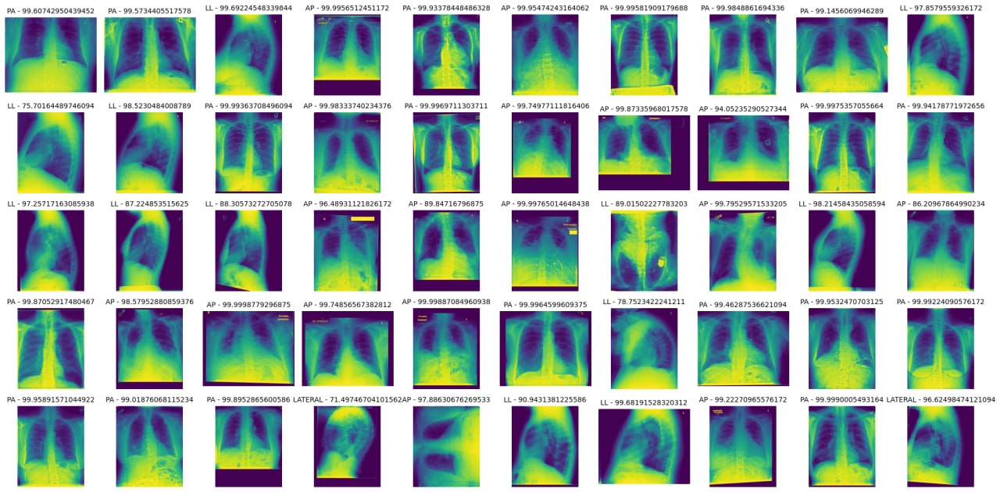
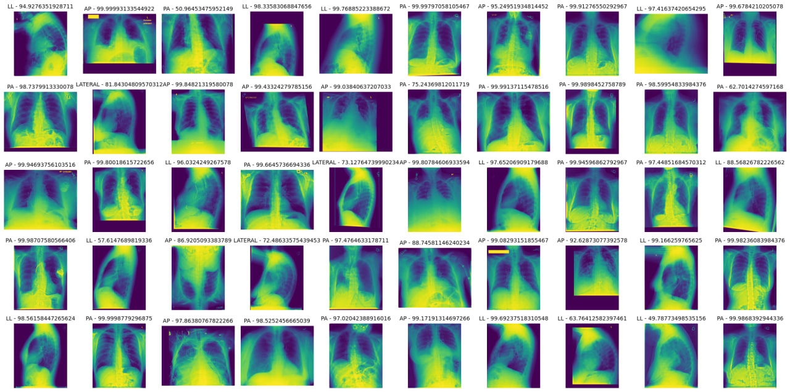

## Detecting the direction of X-ray images

- Training the model to recognize the direction of MRA images
  using [mimic-cxr](https://physionet.org/content/mimic-cxr-jpg/2.1.0/) dataset

## Dataset:

- 352,283 image for train.
- 4,517 image for validation.
- 4,516 image for test.

## Classes:

- 0: AP (Anteroposterior)
- 1: PA (Posteroanterior)
- 2: LATERAL
- 3: LL (Left Lateral)

## Results:

| Data       | Loss   | Accuracy |
|------------|--------|----------|
| Train      | 0.0924 | 97.44%   |
| Validation | 0.0631 | 98.67%   |
| Test       | 0.0608 | 98.82%   |

#### Download model weights from [Google drive]()